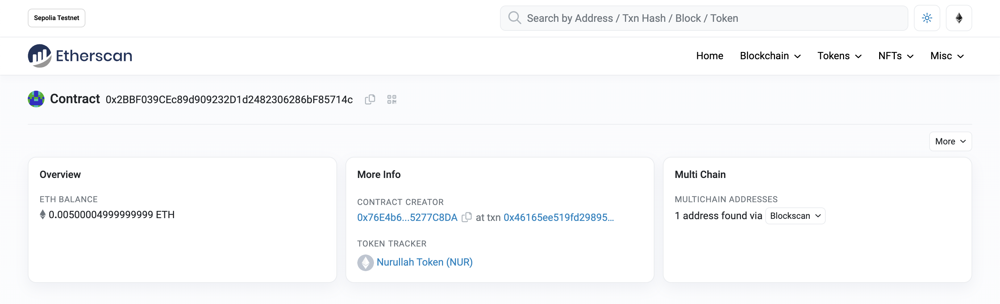
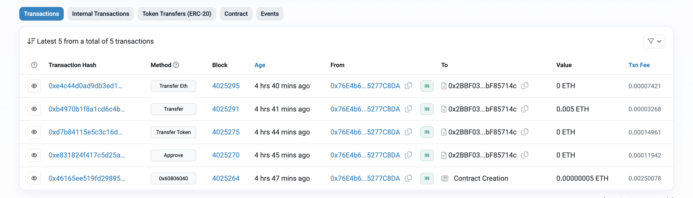

# SendEtherAndERC20Token Contract

## Overview

SendEtherAndERC20Token is a Solidity smart contract that allows users to send Ether and ERC-20 tokens. The contract implements a basic ERC-20 token functionality along with a method to send Ether. It is built using Solidity version 0.8.0 or above.

## Contract Details

## ERC-20 Token Properties

- **Name**: The name of the ERC-20 token.
- **Symbol**: The symbol (ticker) of the ERC-20 token.
- **Decimals**: The number of decimals the token uses.
- **Total Supply**: The total supply of the ERC-20 token.

## Constructor

The constructor is used to initialize the ERC-20 token properties when the contract is deployed.

## ERC-20 Token Functionality

The contract implements the standard ERC-20 token functionality, including:

- **balanceOf**: Function to get the balance of tokens for a given address.
- **allowance**: Function to get the allowance amount for a spender from an owner.
- **approve**: Function to approve a spender to transfer a certain number of tokens on behalf of the owner.
- **transferToken**: Function to transfer ERC-20 tokens from one address to another.
- **transferEth**: Function that allows users to send Ether to a specified recipient.

## Deployment

To deploy the contract, use a development environment compatible with Solidity version 0.8.0 or later. Ensure that you have enough Ether to deploy and set an appropriate initial supply for the ERC-20 token.

## Usage

    1. Deploy the contract to the Ethereum network.
    2. Interact with the contract using the available functions to transfer ERC-20 tokens and send Ether.
    You can use Remix to deploy and interact with the contract for the simplicity.

## Example Deployment

Contract details and transaction history are as follows:

## 💎 Etherscan 💎

You can review the contract details and transaction history from etherscan:

**Link : [https://sepolia.etherscan.io/address/0x2bbf039cec89d909232d1d2482306286bf85714c]**
